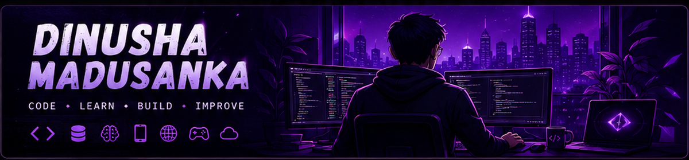

  

   

  # Dinusha Madusanka

  **Software Engineer · Full-Stack Developer · Mobile App Developer · AI/ML Enthusiast**

  Building practical, scalable, user-focused software solutions across web, mobile, backend, and AI-related systems.

---

## About Me

Final-year Software Engineering Undergraduate with hands-on experience in full-stack development, mobile application creation, backend API design, and emerging AI/ML technologies. Passionate about building robust, maintainable systems that solve real-world problems.

**Core Competencies:**

- **Full-Stack Development** — Web (React), Mobile (Kotlin), Backend (FastAPI, Node.js)
- **Mobile Applications** — Android development with Kotlin, modern app architecture
- **Backend Systems** — RESTful APIs, database design (MySQL, PostgreSQL, MongoDB, Firebase)
- **AI & Machine Learning** — NLP, ML model integration, data-driven applications
- **DevOps & Tools** — Docker, Git, GitHub Actions, CI/CD pipelines

---

## Technology Stack

### Languages & Frameworks

  

### Backend

  

### Mobile

  

### AI / Machine Learning

  

### Databases

  

### Tools & DevOps

  

---

## GitHub Activity

---

## Featured Projects

### MindMate-SL

A digital wellness and language-analysis research platform combining speech recognition, sentiment analysis, and personalized learning pathways. Built with a Kotlin client, FastAPI backend, and Firebase for real-time data synchronization.

**Key Features:**
- AI-assisted conversational workflow with NLP processing
- Real-time mood and stress tracking
- Firebase-backed data synchronization
- REST API architecture with secure authentication

**Tech Stack:** `Kotlin` `FastAPI` `Firebase` `Python`

[Repository](https://github.com/dinusha24madusanka/MindMate-SL)

---

### AquaSphere

A collaborative software ecosystem supporting team workflows, project tracking, and real-time communication. Designed for seamless cross-platform access with a modern React frontend and .NET Core backend.

**Key Features:**
- Real-time team collaboration and messaging
- Project tracking and workflow management
- Cross-platform responsive interface
- RESTful API architecture with .NET Core

**Tech Stack:** `.NET` `React`

[Repository](https://github.com/dinusha24madusanka/AquaSphere)

---

### Student Expense Tracker

A mobile financial-management application designed for students, featuring budgeting tools, expense categorization, and secure transaction history. Built with Kotlin using modern Android development practices.

**Key Features:**
- Intuitive budgeting and expense tracking
- Categorized transaction management
- Secure local data storage
- Clean Material Design interface

**Tech Stack:** `Kotlin` `Android Studio`

[Repository](https://github.com/dinusha24madusanka/Student-Expense-Tracker)

---

### Bus Reservation System

A reservation-management application for transit services, enabling real-time seat allocation, route planning, and payment processing. Built with C# and a responsive interface architecture.

**Key Features:**
- Real-time seat availability and booking
- Route planning and management
- Integrated payment processing
- User-friendly reservation workflow

**Tech Stack:** `C#` `React`

[Repository](https://github.com/dinusha24madusanka/Bus-Reservation-System)

---

### Employee Management System

An enterprise-level HR application managing employee data, scheduling, and performance tracking. Designed with cloud integration for scalable departmental operations.

**Key Features:**
- Comprehensive employee data management
- Scheduling and shift allocation
- Performance tracking and reporting
- Cloud-synced data storage

**Tech Stack:** `C#` `SQL`

[Repository](https://github.com/dinusha24madusanka/Employee-Management-System)

---

### Hotel Reservation

A booking and reservation platform for hospitality services, featuring automated availability checks, multi-room management, and guest profile handling. Developed with Java and a responsive web interface.

**Key Features:**
- Automated room availability checks
- Multi-room reservation management
- Guest profile and history tracking
- Responsive web-based interface

**Tech Stack:** `Java` `Web`

[Repository](https://github.com/dinusha24madusanka/Hotel-Reservation)

---

## Engineering Principles

- **Clean Architecture** — Maintainable, scalable code organization
- **API-Driven Systems** — Robust, well-documented interfaces
- **User-Focused Design** — Solutions built around real user needs
- **Continuous Improvement** — Regular refactoring and learning
- **Practical Problem-Solving** — Engineering that delivers real value

---

## Connect

<em>Interested in collaborating on a software project or discussing an opportunity? Feel free to reach out.</em>

---

## Contribution Snake

<picture>
  <source media="(prefers-color-scheme: dark)" srcset="https://raw.githubusercontent.com/dinusha24madusanka/dinusha24madusanka/output/github-contribution-grid-snake-dark.svg">
  <source media="(prefers-color-scheme: light)" srcset="https://raw.githubusercontent.com/dinusha24madusanka/dinusha24madusanka/output/github-contribution-grid-snake.svg">
  
</picture>

---

*Code · Build · Improve*

