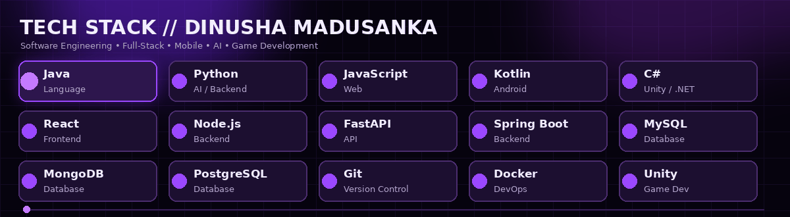

### Hi there 👋

# ɪ'ᴍ ᴅɪɴᴜsʜᴀ ᴍᴀᴅᴜsᴀɴᴋᴀ

### Digital Craftsman
**Software Developer / Full-Stack Developer / Mobile App Developer / AI Enthusiast**

I am a passionate **Software Engineering Undergraduate** who enjoys building practical, user-focused software solutions and continuously improving my engineering skills.

- 🎓 Final Year Software Engineering Undergraduate
- 💻 Interested in Full-Stack Web Development and Software Engineering
- 📱 Building Android applications with Kotlin
- 🧠 Exploring Artificial Intelligence, Machine Learning and NLP
- ⚙️ Working with backend systems and REST APIs
- 🗄️ Using MySQL, MongoDB and PostgreSQL
- 🎮 Exploring Unity game development with C#
- 🤝 Open to collaborating on interesting software projects

---

## 🏆 Gɪᴛʜᴜʙ Tʀᴏᴘʜɪᴇs

---

## 📊 Gɪᴛʜᴜʙ Sᴛᴀᴛs

---

## ⚡ Tᴇᴄʜ Sᴛᴀᴄᴋ & Sᴋɪʟʟs

### 👨‍💻 Languages & Frameworks

  

### 🗄️ Databases

  

### 🛠️ Tools & Platforms

  

### 🌱 Current Learning

- Deepening my knowledge in **Artificial Intelligence and Machine Learning**
- Improving **React.js and modern frontend architecture**
- Building APIs with **Python / FastAPI**
- Improving **Kotlin / Android Development**
- Exploring **Cloud, DevOps and Software Architecture**

---

## 🚀 Fᴇᴀᴛᴜʀᴇᴅ Pʀᴏᴊᴇᴄᴛs

| Project | Description | Tech |
|---|---|---|
| 🧠 **MindMate-SL** | Digital wellness and language-analysis research project | `Kotlin` `Firebase` `Python` |
| 🌊 **AquaSphere** | Collaborative software ecosystem project | `.NET` `React` |
| 💰 **Student Expense Tracker** | Mobile financial-management application for students | `Kotlin` `Android Studio` |
| 🚌 **Bus Reservation System** | Reservation-management application | `C#` |
| 👥 **Employee Management System** | Employee data and management application | `C#` |
| 🏨 **Hotel Reservation** | Hotel booking and reservation project | `Java` |

---

## 📈 Cᴏɴᴛʀɪʙᴜᴛɪᴏɴ Aᴄᴛɪᴠɪᴛʏ

### 🐍 Contribution Snake

<picture>
  <source media="(prefers-color-scheme: dark)" srcset="https://raw.githubusercontent.com/dinusha24madusanka/dinusha24madusanka/output/github-contribution-grid-snake-dark.svg">
  <source media="(prefers-color-scheme: light)" srcset="https://raw.githubusercontent.com/dinusha24madusanka/dinusha24madusanka/output/github-contribution-grid-snake.svg">
  
</picture>

---

## 🤝 Cᴏɴɴᴇᴄᴛ & Cᴏʟʟᴀʙᴏʀᴀᴛᴇ

<!-- Add these when you have the public links:

-->

---

### 💜 Code • Learn • Build • Improve

**Thanks for visiting my GitHub profile!**

